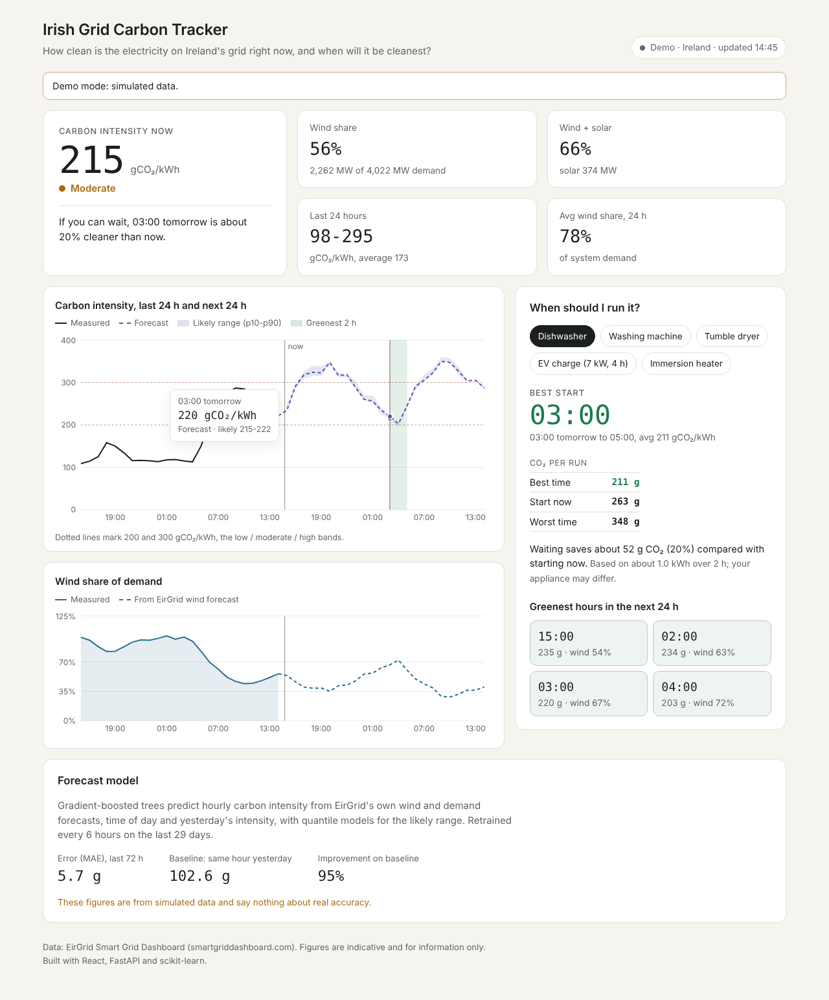

# Irish Grid Carbon Tracker

A web app that shows how clean the electricity on Ireland's grid is right now, forecasts the next 24 hours, and tells households the greenest time to run appliances.



- **Live carbon intensity** (gCO₂/kWh) and **wind share of demand**, from EirGrid's public Smart Grid Dashboard data, refreshed every 5 minutes.
- **24-hour carbon intensity forecast** with a likely range (10th-90th percentile), from a gradient-boosted model trained on recent grid history and EirGrid's own wind and demand forecasts.
- **Greenest-hours recommender**: the best start time for a dishwasher, washing machine, tumble dryer, EV charge or immersion heater, and the CO₂ saved compared with starting now.
- **Model transparency**: accuracy on the most recent 72 hours, compared with a "same hour yesterday" baseline, shown in the app.

Stack: React 18, Vite, Recharts | Python, FastAPI, pandas, scikit-learn | Docker, GitHub Actions, Render.

---

## How it works

```
EirGrid Smart Grid Dashboard  ──>  FastAPI backend  ──>  React dashboard
(15-min CO₂ intensity, wind,       - fetch + cache          - live tiles
 solar, demand, wind & demand      - hourly features        - 48 h intensity chart
 forecasts)                        - forecast model         - wind share chart
                                   - window optimiser       - appliance planner
```

**Data.** The backend calls the same public JSON endpoint the EirGrid dashboard uses (`/api/chart/`), one data series and one day per request (combined requests are much slower on EirGrid's side), in parallel, with a retry. A day that still fails is skipped rather than failing the whole load. If EirGrid sends CO₂ emissions but not the intensity figure, intensity is derived as emissions (tCO₂/h) ÷ demand (MW) × 1000. History older than two days is cached for 6 hours and the recent window for 10 minutes, so EirGrid is not hit on every page view. All parsing of EirGrid's format lives in `backend/app/eirgrid.py`; it is an undocumented endpoint, so that is the one file to update if it changes.

**Forecast model** (`backend/app/forecast.py`). Carbon intensity in Ireland moves mostly with how much demand is met by wind. The model predicts hourly intensity from:

- forecast wind share (EirGrid wind forecast ÷ demand forecast)
- forecast wind and demand in MW
- hour of day (sine/cosine encoded), day of week, weekend flag
- intensity at the same hour yesterday

It uses scikit-learn's `HistGradientBoostingRegressor` with absolute-error loss for the central forecast and two quantile models (p10, p90) for the range. Training uses EirGrid's *forecast* wind, not the actual, so the model sees the same kind of input when training as when predicting. It retrains every 6 hours on the last 21 days and is scored on the final 72 hours, held out in time order, against a seasonal-naive baseline.

**Recommendations** (`backend/app/recommend.py`). For each appliance (typical kWh and run time), every contiguous window in the forecast is scored and the lowest-average window is picked. CO₂ per run = kWh × average intensity.

**Resilience.** `DATA_MODE=auto` (default) uses live data, falls back to the last good live data if EirGrid stops responding, and only then to clearly labelled simulated data. The app always shows which it is using.

---

## Run it locally

You need Python 3.11+ and Node 18+.

```bash
# 1. Backend (terminal 1)
cd backend
python -m venv .venv
# Windows: .venv\Scripts\activate     macOS/Linux: source .venv/bin/activate
pip install -r requirements-dev.txt
uvicorn app.main:app --reload --port 8000

# 2. Frontend (terminal 2)
cd frontend
npm install
npm run dev
```

Open http://localhost:5173. API docs are at http://localhost:8000/docs.

Without internet, run the backend with `DATA_MODE=demo` (Windows PowerShell: `$env:DATA_MODE="demo"`).

Tests: `cd backend && pytest -q`

### API

| Endpoint | Returns |
|---|---|
| `GET /api/dashboard` | Everything the front end needs, in one call |
| `GET /api/current` | Latest intensity, wind share, demand |
| `GET /api/history?hours=24` | Hourly measured intensity and wind share |
| `GET /api/forecast` | Next 24 h forecast with p10/p90 and model metrics |
| `GET /api/recommendations?appliance=ev_charge` | Best window and CO₂ saving |
| `GET /api/appliances` | Appliance assumptions |

### Settings (environment variables)

| Variable | Default | Meaning |
|---|---|---|
| `DATA_MODE` | `auto` | `auto`, `live` or `demo` |
| `GRID_REGION` | `ROI` | `ROI`, `NI` or `ALL` (all-island) |
| `TRAINING_DAYS` | `21` | Days of history for training |
| `ALLOWED_ORIGINS` | `*` | Front-end URLs allowed to call the API |
| `VITE_API_URL` | empty | (frontend) backend URL if hosted separately |

---

## Deploy (free) - step by step

The repository builds into **one Docker container** that serves both the API and the React app, so there is one service and one URL.

### 1. Put the code on GitHub

1. Create a new empty repository on GitHub, e.g. `irish-grid-carbon-tracker` (no README, no .gitignore).
2. In a terminal, inside this folder:

```bash
git init
git add .
git commit -m "Irish Grid Carbon Tracker: live data, forecast model, appliance planner"
git branch -M main
git remote add origin https://github.com/<your-username>/irish-grid-carbon-tracker.git
git push -u origin main
```

GitHub Actions will run the tests and the front-end build on every push (see the Actions tab).

### 2. Deploy on Render

1. Sign in at https://render.com with GitHub.
2. **New > Blueprint**, pick the repository. Render reads `render.yaml` and creates the web service.
3. Click **Apply**. The first build takes a few minutes.
4. Open the URL Render gives you (like `https://irish-grid-carbon-tracker.onrender.com`). The header should say **Live**.

On Render's free plan the service sleeps after about 15 minutes without visitors, so the first load after a quiet spell takes 30-60 seconds while it wakes and retrains. That is normal.

### Alternative: frontend on Vercel, backend on Render

1. Deploy the backend as above (it works on its own).
2. On Vercel, import the repo, set **Root Directory** to `frontend`, framework **Vite**, and add the environment variable `VITE_API_URL=https://<your-render-url>`.
3. On Render, set `ALLOWED_ORIGINS=https://<your-vercel-url>`.

---

## Get real accuracy numbers

The accuracy shown on the live site comes from real data. For a fuller test, run the backtest on your own machine (needs internet):

```bash
cd backend
python evaluate.py --days 56 --folds 7
```

For each of the last 7 days it trains only on earlier data, forecasts that day, and compares with what happened. It prints and saves `evaluation.json` with:

- `mae_gco2_kwh` - average forecast error
- `mae_baseline_gco2_kwh` - error of "same hour yesterday"
- `improvement_vs_baseline_pct`
- `avg_green_window_gap_gco2_kwh` - how much dirtier the recommended 2-hour window was than the truly best one (0 = perfect pick)

Use these figures, not the demo ones, anywhere you describe the project.

---

## Project layout

```
backend/
  app/eirgrid.py      EirGrid client, parser, demo data generator
  app/data.py         caching and live/demo fallback
  app/forecast.py     features, model training, 24 h prediction
  app/recommend.py    appliance windows and greenest hours
  app/main.py         FastAPI routes (also serves the built React app)
  evaluate.py         rolling-origin backtest on real data
  tests/              pytest suite (parser, client, model, recommender, API)
frontend/
  src/App.jsx         page layout and data loading
  src/components/     NowPanel, charts, Planner, ModelCard
Dockerfile            single-container build (Node build stage + Python runtime)
render.yaml           Render blueprint
.github/workflows/    CI
```

## Troubleshooting

**The badge says "Demo".** EirGrid did not answer, and the yellow note at the top gives the reason. The app tries again every 2 minutes. To see exactly what EirGrid is returning, run this from the `backend` folder:

```bash
python check_eirgrid.py
```

Each line shows OK or FAIL for one request. If every line fails, EirGrid's site is down or slow; try later. If only the `co2` lines fail, the CO₂ part of their service is having problems.

## Notes and limits

- Data comes from EirGrid's Smart Grid Dashboard, which is provided for general information. This project is not affiliated with EirGrid.
- Carbon intensity here is EirGrid's average figure for generation; it is not the marginal emissions of switching a device on.
- Appliance energy use is a typical value per cycle; real figures vary by model and programme.
- The October clock change creates one duplicated local hour; that hour is dropped rather than guessed.
